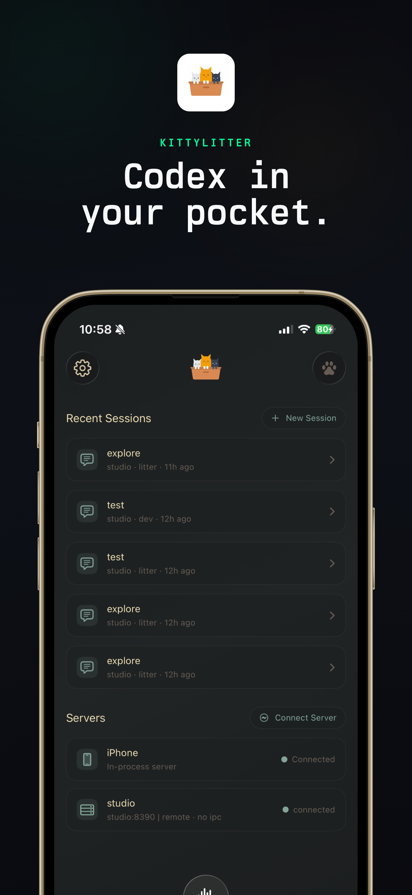
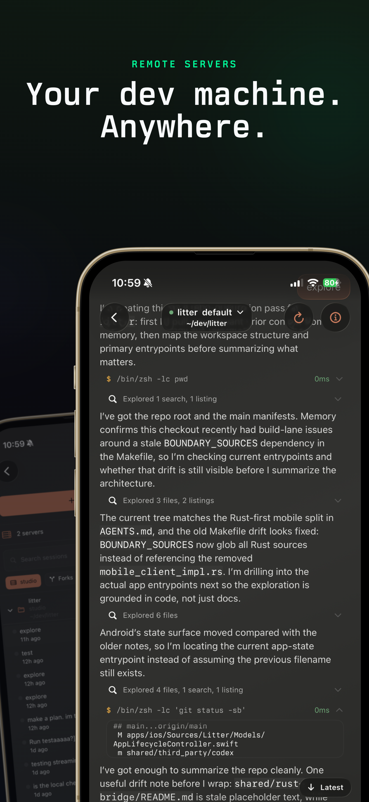
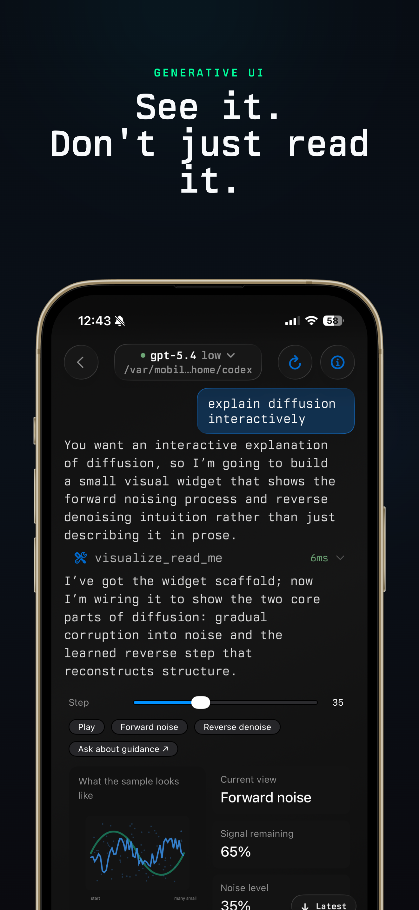
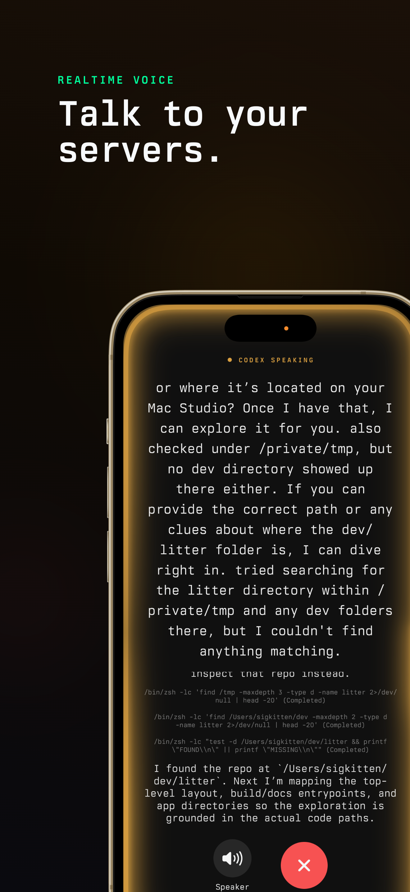

# litter

<p align="center">
  
</p>

<p align="center">
  Native iOS + Android client for <a href="https://github.com/openai/codex">Codex</a>. Connect to local or remote servers, manage sessions, and run agentic coding workflows from your phone.
</p>

<p align="center">
  <a href="https://kittylitter.app"></a>
  &nbsp;
  <a href="https://apps.apple.com/us/app/kittylitter/id6759521788"></a>
  &nbsp;
  <a href="https://kittylitter.app/android-beta"></a>
</p>

## Screenshots (iOS)

<p align="center">
  
  
  
  
</p>

## Quick Start

```bash
make ios-device-fast   # fast device build
make ios-sim-fast      # fast simulator build
make android-emulator-fast  # fast Android emulator build
```

See [docs/DEVELOPMENT.md](docs/DEVELOPMENT.md) for prerequisites, full build options, TestFlight/App Store release, and SSH setup.

## Repository Layout

```
apps/ios/                  iOS app (Litter scheme, project.yml is source of truth)
apps/android/              Android app (Compose UI, Gradle build)
shared/rust-bridge/
  codex-mobile-client/     Shared Rust client crate + UniFFI surface (iOS & Android)
  codex-ios-audio/         iOS-only audio/AEC crate
shared/third_party/codex/  Upstream Codex submodule
patches/codex/             Local patch set applied during builds
tools/scripts/             Cross-platform helper scripts
```

## Architecture

Both platforms share a single Rust core (`codex-mobile-client`) via UniFFI-generated bindings. Platform code (Swift/Kotlin) stays thin: UI, permissions, notifications, and platform APIs only. Session state, streaming, hydration, discovery, and auth logic live in Rust.

## Make Targets

| Target | Description |
|---|---|
| `make ios-device-fast` | Fast device build (raw staticlib) |
| `make ios-sim-fast` | Fast simulator build |
| `make ios` | Full package lane (device + sim + xcframework) |
| `make android-emulator-fast` | Fast Android emulator build |
| `make android` | Full Android pipeline |
| `make rust-check` | Host `cargo check` for shared Rust crates |
| `make rust-test` | Host `cargo test` for shared Rust crates |
| `make bindings` | Regenerate UniFFI Swift + Kotlin bindings |
| `make xcgen` | Regenerate Xcode project from `project.yml` |
| `make clean` | Remove all build artifacts |
